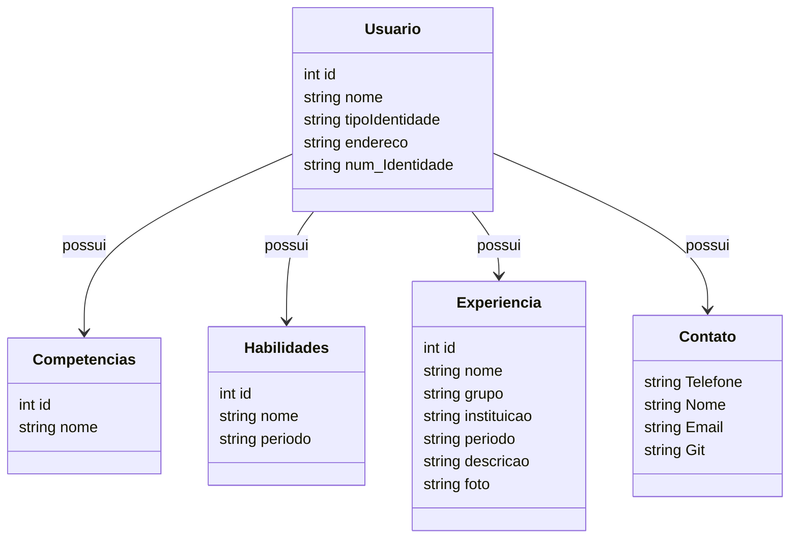

# API RESTful para gerenciar serviços. 

## Objetivo
Esta aplicação vem com objetivo de replicar boas praticas ofertadas do curso de "Publicando Sua API REST na Nuvem Usando Spring Boot 3, Java 17 e Railway" no qual foi lencionado pelo [Venilton Falvo Jr, Tech Lead](https://github.com/falvojr)[, DIO](https://web.dio.me/)

## Principais Tecnologias
 - **Java 17**: Utilizaremos a versão LTS mais recente do Java para tirar vantagem das últimas inovações que essa linguagem robusta e amplamente utilizada oferece;
 - **Spring Boot 3**: Trabalharemos com a mais nova versão do Spring Boot, que maximiza a produtividade do desenvolvedor por meio de sua poderosa premissa de autoconfiguração;
 - **Spring Data JPA**: Exploraremos como essa ferramenta pode simplificar nossa camada de acesso aos dados, facilitando a integração com bancos de dados SQL;
 - **OpenAPI (Swagger)**: Vamos criar uma documentação de API eficaz e fácil de entender usando a OpenAPI (Swagger), perfeitamente alinhada com a alta produtividade que o Spring Boot oferece;
 - **Railway**: facilita o deploy e monitoramento de nossas soluções na nuvem, além de oferecer diversos bancos de dados como serviço e pipelines de CI/CD.

## Diagrama de Classe

##Documentação da API (Swagger)
[https://sdw-2023-prd.up.railway.app/swagger-ui.html
](https://sdw2024springjavarailway.up.railway.app/swagger-ui/index.html)Esta API ficará disponível no Railway por um período de tempo limitado ja que o objetivo é didatico. Entre contato com o [Suporte
](https://w.app/JFpGq4).
